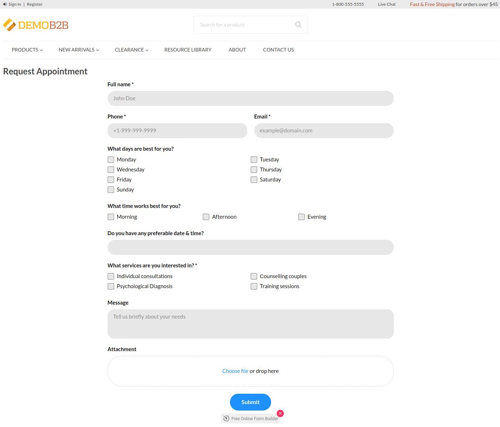
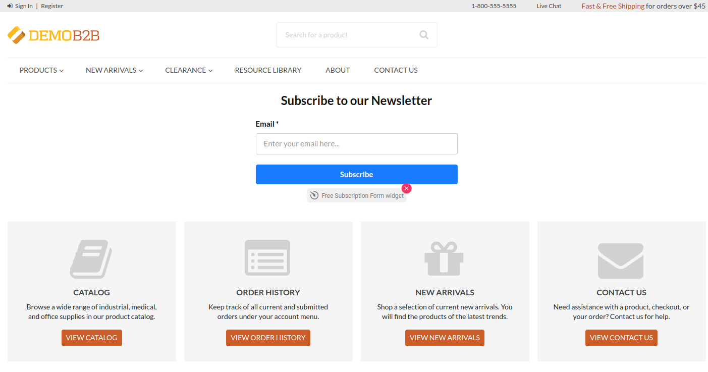
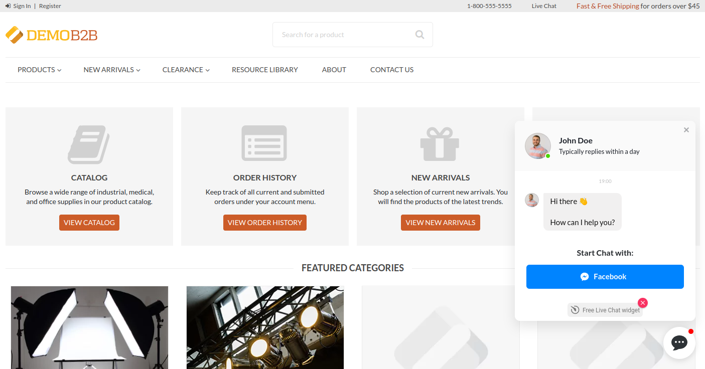
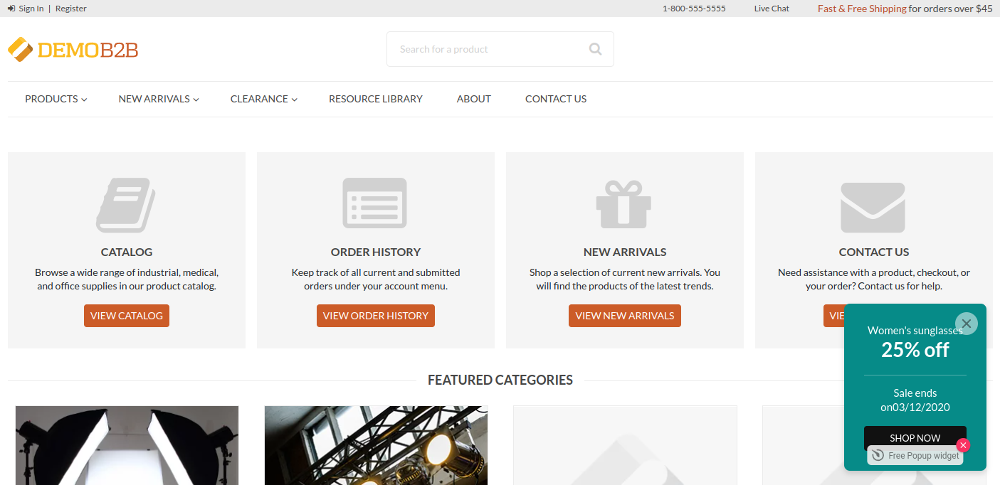
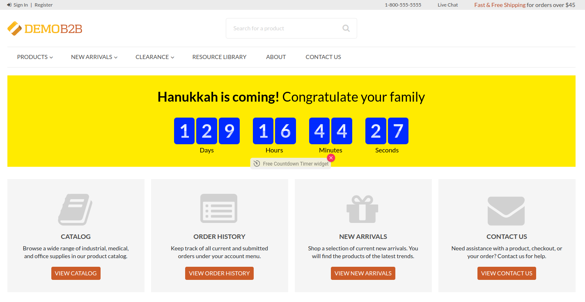
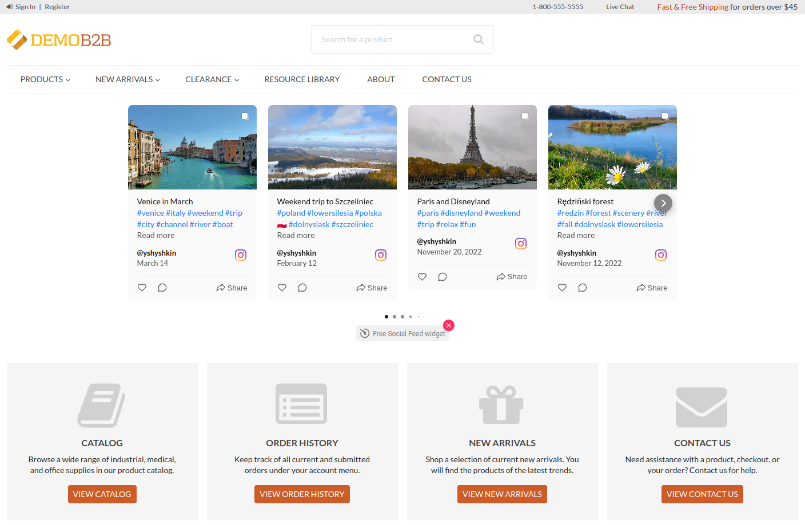

# OroCommerceElfsightBundle

The bundle adds OroCommerce integration with the [Elfsight](https://go.elfsight.io/click?pid=233&offer_id=3) 
widget provider, and puts multiple content blocks into strategic places all over the application storefront.

Now developers can add custom forms, subscription forms, live chats, various popups, countdown timers, 
social feeds and many other types widgets to the storefront.

* [Widget Types](#widget-types)
    * [Form Builder](#form-builder)
    * [Subscription Form](#subscription-form)
    * [Live Chat](#live-chat)
    * [Popup](#popup)
    * [Countdown Timer](#countdown-timer)
    * [Social Feed](#social-feed)
    * [Other Widgets](#other-widgets)
* [Content Blocks](#content-blocks)
* [How To Install The Bundle](#how-to-install-the-bundle)
* [How To Add Widgets](#how-to-add-widgets)
* [How To Thank The Author](#how-to-thank-the-author)

## Widget Types

Here are the most popular widget types used in Ecommerce that you can add 
through this integration.

### Form Builder

[Form builder widget](https://go.elfsight.io/click?pid=233&offer_id=3&l=1677843053) can help you to build a completely
custom form from scratch, collect the data, send email notification, analyze the data, and many other things.

### Subscription Form

[Subscription form widget](https://elfsight.com/subscription-form-widget/) lets you collect emails of people
who wants to be notified when something happens.

### Live Chat

[All-in-one chat widget](https://go.elfsight.io/click?pid=233&offer_id=3&l=1677841093) allows you to talk 
to your customers in real time and assist them when they need help.

### Popup

[Popup widget](https://elfsight.com/banner-widget/) shows a banner with your marketing materials.
It is a great tool to notify your customers about events or just say them hello.

### Countdown Timer

[Countdown widget](https://go.elfsight.io/click?pid=233&offer_id=3&l=1677841108) helps you to let customers 
how much time left till something important is going to happen.

### Social Feed

[Social feed widget](https://go.elfsight.io/click?pid=233&offer_id=3&l=1677843061) aggregates news 
from your social networks and shows them in a nice convenient form.

### Other Widgets

There are many other widget types that you can add to your website. 
Check the [full list of widgets](https://elfsight.com/widgets/) and find the best widget for you.

## Content Blocks

TODO

## How To Install The Bundle

TODO

## How To Add Widgets

TODO

## How To Thank The Author

If this bundle helped you and you are feeling generous today, then you can thank the author
and support this initiative using one of the following buttons.

