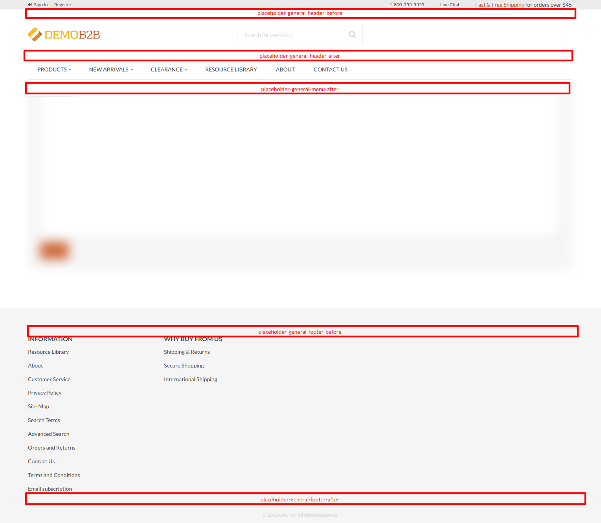
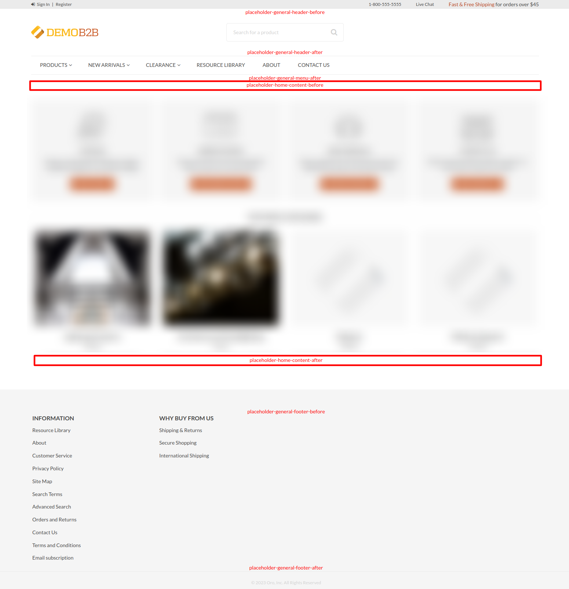
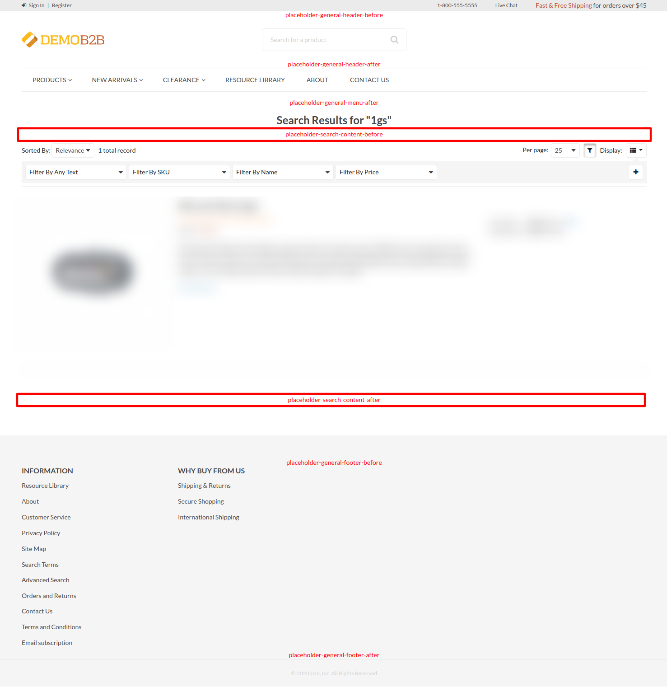
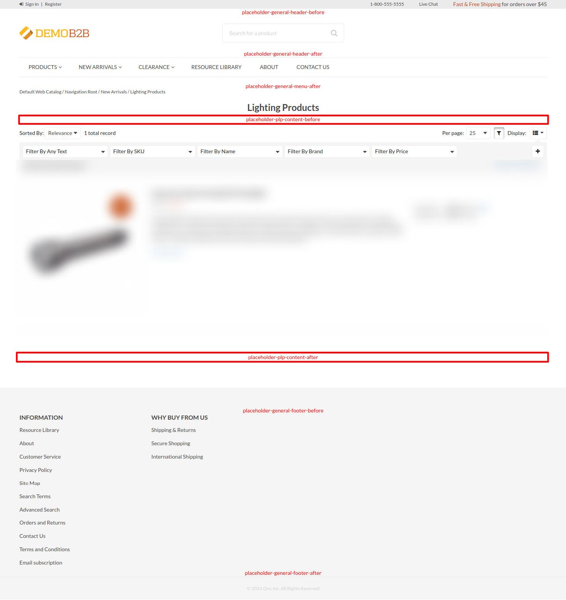
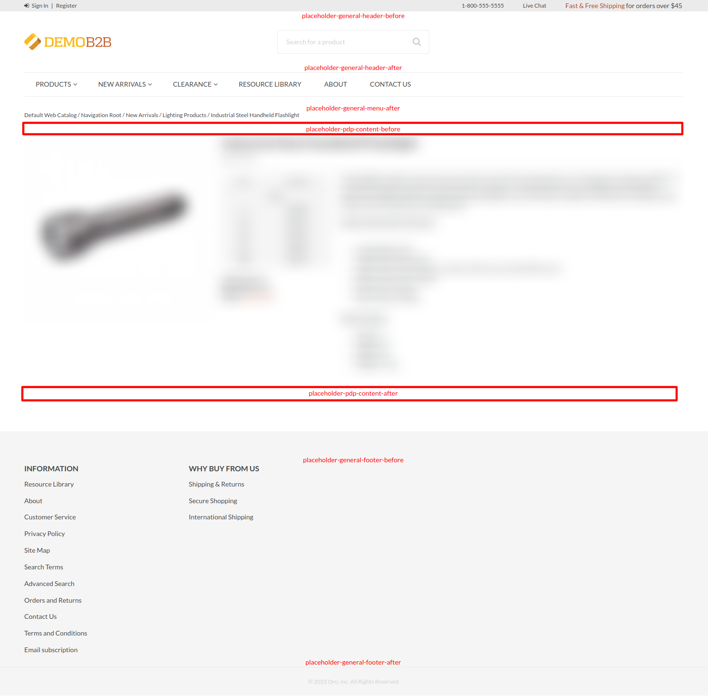
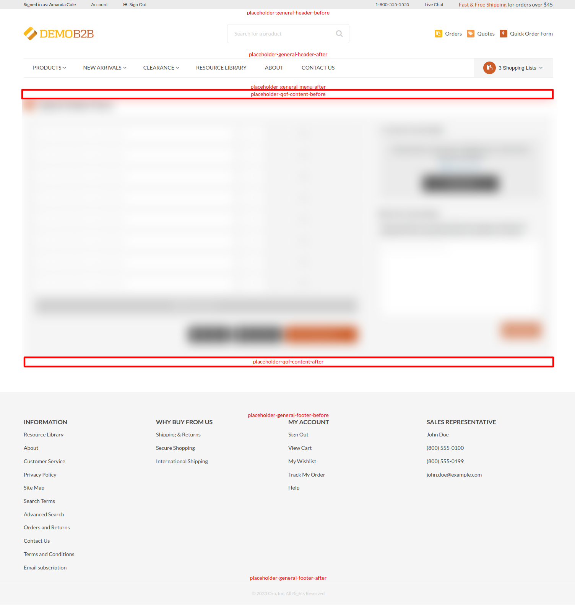
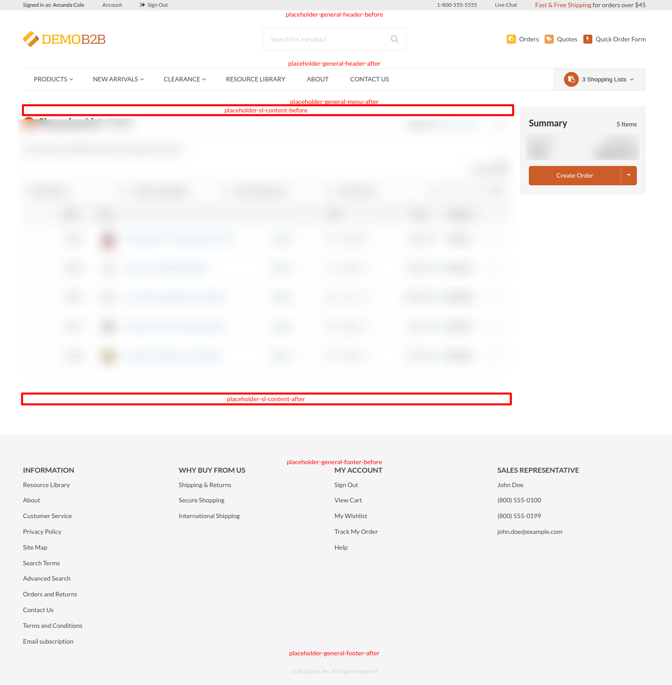
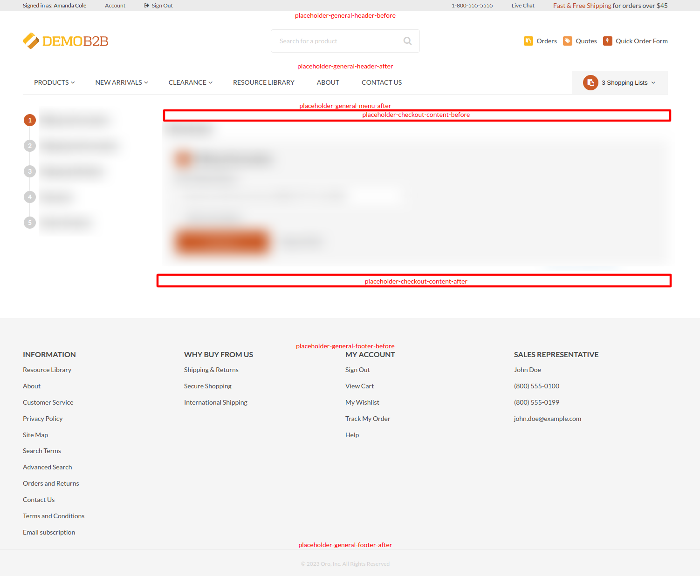

# OroCommerce Elfsight Bundle

The bundle adds integration with the [Elfsight](https://go.elfsight.io/click?pid=233&offer_id=3) 
widget provider, and puts multiple content blocks into strategic places all over the application storefront.

Now developers can add custom forms, subscription forms, live chats, various popups, countdown timers, 
social feeds and many other types widgets to the storefront.

* [Widget Types](#widget-types)
    * [Form Builder](#form-builder)
    * [Subscription Form](#subscription-form)
    * [Live Chat](#live-chat)
    * [Popup](#popup)
    * [Countdown Timer](#countdown-timer)
    * [Social Feed](#social-feed)
    * [Other Widgets](#other-widgets)
* [Content Blocks](#content-blocks)
    * [All Pages](#all-pages)
    * [Home Page](#home-page)
    * [Search Results Page](#search-results-page)
    * [Product Listing Page](#product-listing-page)
    * [Product Details Page](#product-details-page)
    * [Quick Order Form Page](#quick-order-form-page)
    * [Shopping List Page](#shopping-list-page)
    * [Checkout Page](#checkout-page)
* [How To Install The Bundle](#how-to-install-the-bundle)
* [How To Add Widgets](#how-to-add-widgets)
* [How To Thank The Author](#how-to-thank-the-author)

## Widget Types

Here are the most popular widget types used in Ecommerce that you can add 
through this integration.

### Form Builder

[Form builder widget](https://go.elfsight.io/click?pid=233&offer_id=3&l=1677843053) can help you to build a completely
custom form from scratch, collect the data, send email notification, analyze the data, and many other things.

### Subscription Form

[Subscription form widget](https://elfsight.com/subscription-form-widget/) lets you collect emails of people
who wants to be notified when something happens.

### Live Chat

[All-in-one chat widget](https://go.elfsight.io/click?pid=233&offer_id=3&l=1677841093) allows you to talk 
to your customers in real time and assist them when they need help.

### Popup

[Popup widget](https://elfsight.com/banner-widget/) shows a banner with your marketing materials.
It is a great tool to notify your customers about events or just say them hello.

### Countdown Timer

[Countdown widget](https://go.elfsight.io/click?pid=233&offer_id=3&l=1677841108) helps you to let customers 
how much time left till something important is going to happen.

### Social Feed

[Social feed widget](https://go.elfsight.io/click?pid=233&offer_id=3&l=1677843061) aggregates news 
from your social networks and shows them in a nice convenient form.

### Other Widgets

There are many other widget types that you can add to your website. 
Check the [full list of widgets](https://elfsight.com/widgets/) and find the best widget for you.

## Content Blocks

By default, you can add Elfsight widgets to any place that supports content widgets: landing pages, 
product and category descriptions, predefined content blocks. 

This bundle adds new content blocks to different pages all over the application, so you can add Elfsight 
widgets to any of that blocks. Some Elfsight widgets that are always presented on screen (e.g. live chat, popup) 
can be added to any block. Other widgets that have to be added to the right place on the page (e.g. forms, social feeds)
should be added to the right content block.

Here are all pages with new content blocks added to them.

### All Pages

* `placeholder-general-header-before` added before the header;
* `placeholder-general-header-after` added after the header;
* `placeholder-general-menu-after` added after the main menu;
* `placeholder-general-footer-before` added before the footer;
* `placeholder-general-footer-after` added after the footer.

### Home Page

* `placeholder-home-content-before` added before the home page content;
* `placeholder-home-content-after` added after the home page content.

### Search Results Page

* `placeholder-search-content-before` added before the search results grid;
* `placeholder-search-content-after` added after the search results grid.

### Product Listing Page

* `placeholder-plp-content-before` added before the products grid;
* `placeholder-plp-content-after` added after the products grid.

### Product Details Page

* `placeholder-pdp-content-before` added before the product details;
* `placeholder-pdp-content-after` added after the products details.

### Quick Order Form Page

* `placeholder-qof-content-before` added before the quick order form;
* `placeholder-qof-content-after` added after the quick order form.

### Shopping List Page

* `placeholder-sl-content-before` added before the shopping list content;
* `placeholder-sl-content-after` added after the shopping list content.

### Checkout Page

* `placeholder-checkout-content-before` added before the checkout content;
* `placeholder-checkout-content-after` added after the checkout content.

TODO

## How To Install The Bundle

TODO

## How To Add Widgets

TODO

## How To Thank The Author

If this bundle helped you and you are feeling generous today, then you can thank the author
and support this initiative using one of the following buttons.

